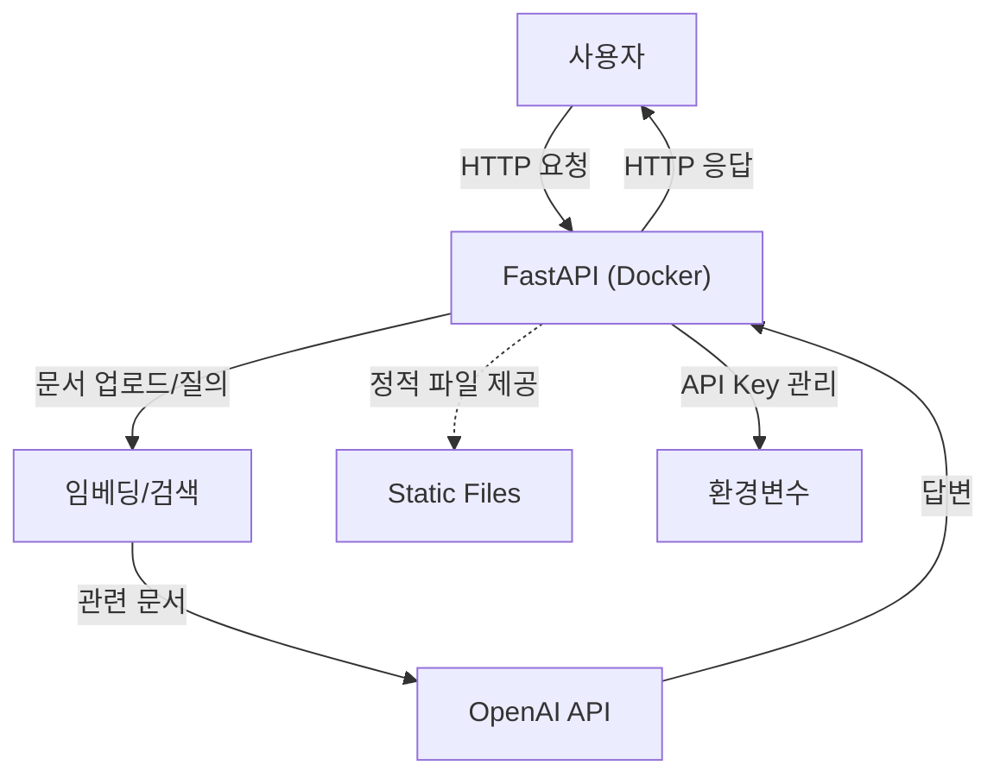

# RAG 문서 QA API

이 프로젝트는 FastAPI와 LangChain, OpenAI API를 이용해서 문서 기반 질의응답 API를 만드는 실습용 프로젝트입니다. 문서를 업로드하면 임베딩해서 벡터DB에 저장하고, 질문이 들어오면 관련 내용을 찾아서 OpenAI로 답변을 생성합니다. 개발과 테스트, 그리고 Docker로 패키징해서 환경에 상관없이 실행할 수 있도록 했습니다.

---

## 사용 기술 및 구성

- FastAPI: Python 비동기 API 서버
- Uvicorn: ASGI 서버
- LangChain: 문서 임베딩/검색 파이프라인
- ChromaDB: 벡터 DB
- OpenAI API: 답변 생성
- Docker: 컨테이너 패키징
- python-dotenv: 환경변수 관리
- pytest: 테스트 코드 작성 (외부 API는 Mocking)

---

## 아키텍처



---

## 실행 방법

1. Docker 이미지 빌드
   ```bash
   docker build -t rag-fastapi-app .
   ```
2. 컨테이너 실행 (API Key는 환경변수로 전달)
   ```bash
   docker run -d -p 8000:8000 --env OPENAI_API_KEY=your_openai_key rag-fastapi-app
   ```
3. API 문서: http://localhost:8000/docs

---

## 테스트

- pytest로 주요 기능 테스트
- 외부 API는 Mocking 처리해서 테스트

---

## 환경변수

- .env 파일 또는 Docker 환경변수로 OpenAI API Key 등 관리

---

## 주요 파일

```
main.py                # FastAPI 앱 진입점
requirements.txt       # 의존성 목록
Dockerfile             # 도커 설정
static/                # 정적 파일
config.py              # 환경설정
qa_chain.py            # 질의응답 체인
문서 임베딩/검색 관련 파일 등
```

---

## 기타

- 모든 의존성은 Docker 이미지에 포함되어 있습니다.
- 실제 배포는 하지 않았고, 로컬에서 Docker로 이미지 생성 및 실행까지 테스트했습니다.
- 민감 정보는 환경변수로만 관리합니다.

